# Milestone project 3
## uniform_exchange_hub

Welcome to the third milestone project for Runshaw College and Code Institute. Our platform, Uniform Exchange Hub, is dedicated to making school uniforms accessible and affordable for everyone. This website allows users to find pre-loved school uniforms, exchange them, donate to a uniform bank, or acquire second-hand uniforms for their children.

Built using MongoDB and Flask, the application offers a comprehensive CRUD (Create, Read, Update, Delete) functionality along with robust user authentication. Users can easily register, log in, log out, edit profiles, view profiles, search for uniforms, and even delete their accounts.

## 1. Purpose of the project
  ### 1.1. Business Goals
Uniform Exchange Hub aims to:

- Promote sustainable fashion by encouraging the reuse of school uniforms.

- Make school uniforms accessible and affordable for every family.

- Build a supportive community where people can help one another.

- Reduce textile waste by offering a platform for uniform donations and exchanges.

### 1.2. Developer's Goals
As developers, our objectives are to:

- Create a user-friendly, intuitive interface that simplifies the process of exchanging uniforms.

- Create security for all user data with comprehensive user authentication mechanisms.

- Optimize the performance of the website for seamless user experience.
## 2. User stories
- As a parent, I want to easily search for available school uniforms in my child's age so that I can find what I need quickly.

- As a donor, I want to donate uniforms my child has outgrown so that other families can benefit from them.

- As a registered user, I want to exchange my uniforms for different sizes so that my children can have well-fitting uniforms throughout the school year.

- As a user, I want to see a detailed profile page so that I can manage my personal information and donations.

- As an admin, I want to manage user accounts and listings so that the platform remains organized and user-friendly.

- As a new user, I want to register easily so that I can quickly start using the platform.

- As a user, I want to log in and log out securely so that my personal data is protected.

## 3. Features
   ### 3.1. Existing features
   * Navigation bar on the top helps to navigate between different pages. \
   Nav bar for logged in users:\
     \
   Nav bar, when the user haven't logged in yet: \
    
   * User registration and authentication. \
    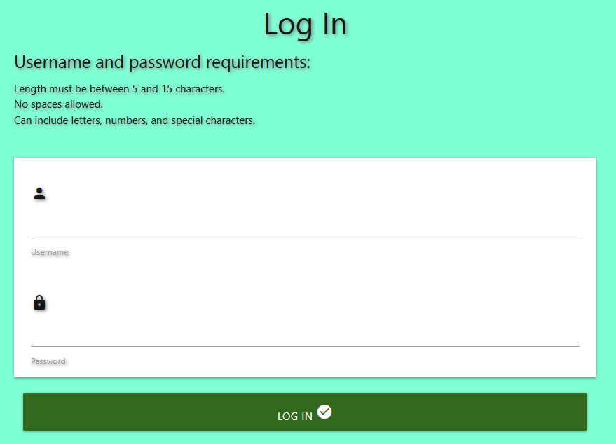 \
     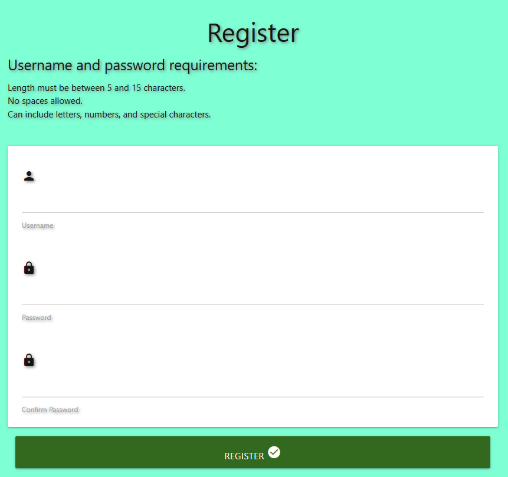
   * Profile display, and management. \
    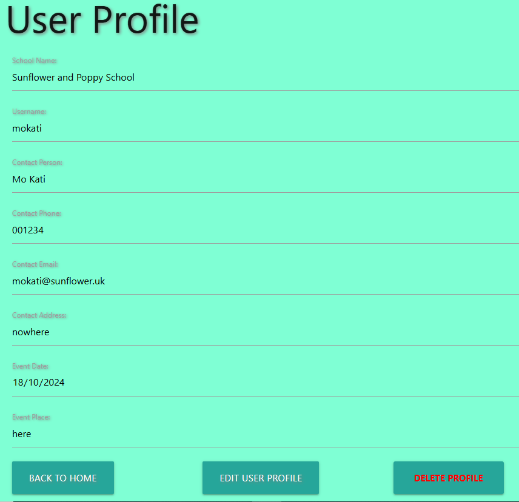
   * Adding items to user's profile. \
    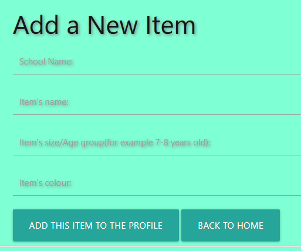
   * Listing items for users on their profile. \
    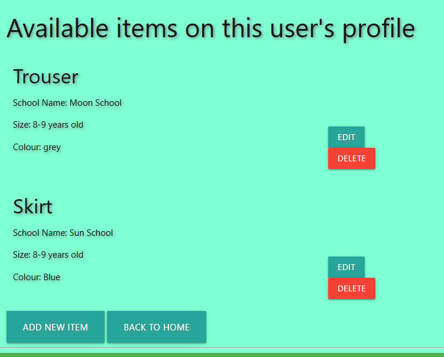
   * Uniform search. \
    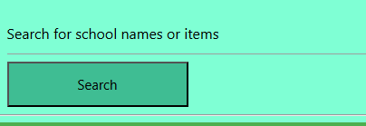
   * Intorduction to this charity website. \
    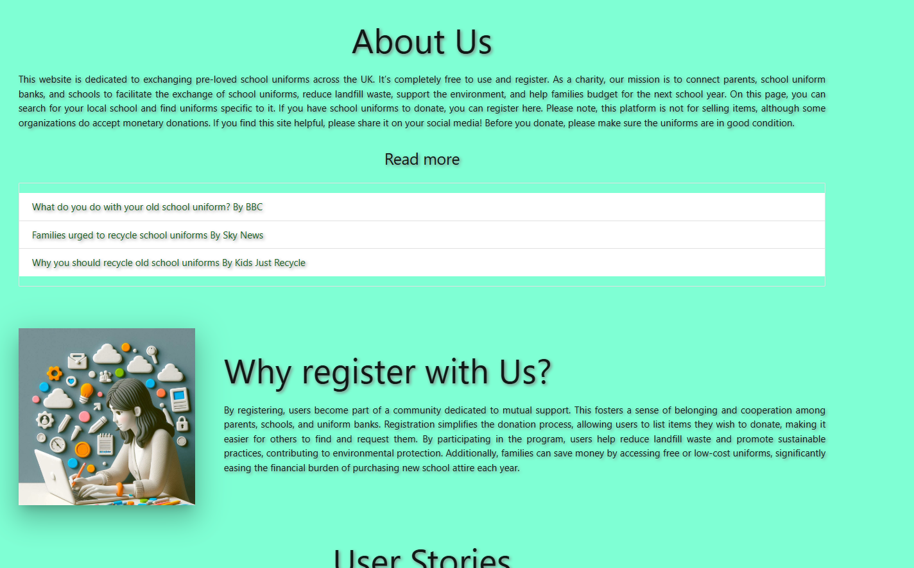
   * Footer with some additional information. \
    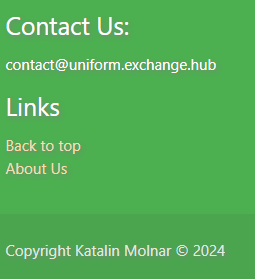
   ### 3.2. Future features
   * Possibility to share this website on social media like Instagram, Facebook, etc.
   * Basis chat function to answer some questions or if AI can't answer the question, send an email to Support.
   * Connecting TrustPilot or other website, and asking people for reviews.
## 4. Typography and color scheme
* Google Fonts: I used Raleway font-family, and serif for backup.
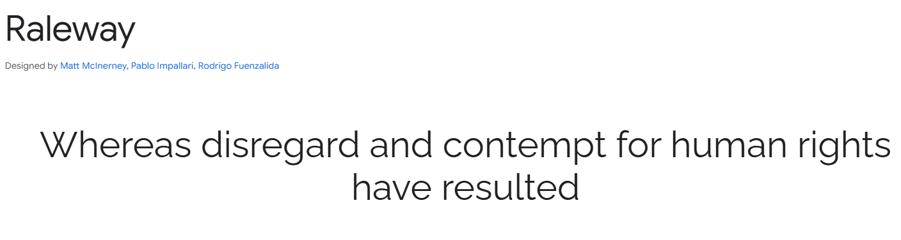
* Colour palette: \
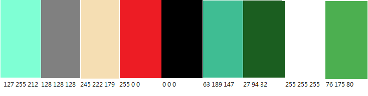
* Images for the website were created with Microsoft Copilot
## 5. Wireframes
I used Balsamiq to create my wireframes. There are more pages, you can chack them here: 
* [Home Page](static/images/Home%20Page.pdf)
* [Search Page](static/images/Search%20Page.pdf)
* [Log In Page](static/images/Log%20in%20page.pdf)
* [Register Page](static/images/Register%20page.pdf)
* [Profile Page](static/images/Profile%20page.pdf)
* [Edit Profile Page](static/images/Edit%20Profile%20page.pdf)
* [Add Item Page](static/images/Add%20Item%20page.pdf)
* [List of items page](static/images/List%20of%20items%20page.pdf)

I modified my wireframe a couple of times; this is the latest version. This wireframe helped me to position things and organize my content.
## 6. Technologies used
* I used HTML to create the layout and the basic structure for the website.
* Materialize CSS to style the website.
* Flask micro framework to build the functionality of this website.
* JavaScript to help with modals, date picker, confirm delete, add item and collapsibles.
* MongoDB to store user's data.
* Jinja to help with the interactivity for dynamic website. Works really well with Flask.
* I used Balsamiq for my wireframe, so I could think about the structure of my website, size the features, and see how things can work/function.
* I used git for version control.
* I used GitHub to save my repository.
* I used Microsoft Copilot and Blackbox AI to check my code, create pictures and advise improvement.
* I used [www.canva.com](https://www.canva.com) to create mockups for different screen sizes.
## 7. Testing
   ### 7.1 Code validation
   * I used the official [W3C validator](https://validator.w3.org/) for testing HTML, and there were no errors. \
   
   * [Official (jigsaw) validator](https://jigsaw.w3.org/css-validator/validator.html.en) for testing CSS, and my code had no errors. \
   
   * I used 
   * Lighthouse report in Google Chrome. I checked the accessibility, performance, and best practices here. \
   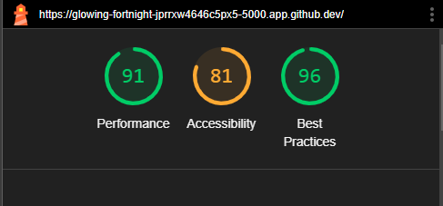
   ### 7.2 Test Plan Tables
   ***********************************
   **7.2.1. Test Plan Table for Microsoft Edge on Desktop for Home page**
   **********
   |Test| User requirement addressed | Expected result | Actual result | Pass / Fail | Date | Corrective Action
   |--------------:|:--------------------------:|:---------------:|:-------------:|:-----------:|:----:|:-----------------
   |Nav-bar appears|Website is easy to navigate|Nav-bar appears|As expected|Pass|20/1/25|None
   |Nav-bar hyperlinks work|Website is easy to navigate|When you move the mouse over, it will become green and underlined.|As expected|Pass|20/1/25|None
   |Hero image appears|Hero image is visible|Hero image is on the top of the website|As expected|Pass|20/1/25|None
   |Website name and subtitle appears|Text is readable|Text is visible|As expected|Pass|20/1/25|None
   |Text of the website appears|Text is visible|Text is readable|As expected|Pass|20/1/25|None
   |External links work|User can visit website|If user click the link , can visit the website|As expected|Pass|20/1/25|None
   |Picture appears|Picture is visible|Next to the text (Why register with Us?), there is a picture|As expected|Pass|20/1/25|None
   |Dropdown test|Users can check answers|Clicking on dropdown, user can read the answer|As expected|Pass|20/1/25|None
   |Footer appears|Text is visible|Text is readable|As expected|Pass|20/1/25|None
   |Footer's links work|Website is easy to navigate|Clicking on the link, goes to the right place|As expected|Pass|20/1/25|None

   ***********************************
   **Test Plan Table for Microsoft Edge on Desktop for Log In page**
   **********
   |Test| User requirement addressed | Expected result | Actual result | Pass / Fail | Date | Corrective Action
   |--------------:|:--------------------------:|:---------------:|:-------------:|:-----------:|:----:|:-----------------
   |Nav-bar appears|Website is easy to navigate|Nav-bar appears|As expected|Pass|20/1/25|None
   |Nav-bar hyperlinks work|Website is easy to navigate|When you move the mouse over, it will become green and underlined.|As expected|Pass|20/1/25|None
   |Hero image appears|Hero image is visible|Hero image is on the top of the website|As expected|Pass|20/1/25|None
   |Website name and subtitle appears|Text is readable|Text is visible|As expected|Pass|20/1/25|None
   |Text of the website appears|Text is visible|Text is readable|As expected|Pass|20/1/25|None
   |Input field test|Input field for username and password works|User can write username and password in the input field|As expected|Pass|20/1/25|None
   |Log in button test|User can log in using the button|Clicking the log in button, user can log in|As expected|Pass|20/1/25|None
   |Register hyperlink test|User can navigate to the Register page|Clicking on the register link, user navigate to the register page|As expected|Pass|20/1/25|None
   |Footer appears|Text is visible|Text is readable|As expected|Pass|20/1/25|None
   |Footer's links work|Website is easy to navigate|Clicking on the link, goes to the right place|As expected|Pass|20/1/25|None

   ************************************
   **Test Plan Table for Microsoft Edge on Desktop for Register page**
   **********
   |Test| User requirement addressed | Expected result | Actual result | Pass / Fail | Date | Corrective Action
   |--------------:|:--------------------------:|:---------------:|:-------------:|:-----------:|:----:|:-----------------
   |Nav-bar appears|Website is easy to navigate|Nav-bar appears|As expected|Pass|20/1/25|None
   |Nav-bar hyperlinks work|Website is easy to navigate|When you move the mouse over, it will become green and underlined.|As expected|Pass|20/1/25|None
   |Hero image appears|Hero image is visible|Hero image is on the top of the website|As expected|Pass|20/1/25|None
   |Website name and subtitle appears|Text is readable|Text is visible|As expected|Pass|20/1/25|None
   |Text of the website appears|Text is visible|Text is readable|As expected|Pass|20/1/25|None
   |Input field test|Input field for username, password and confirm password works|User can write username and password in the input field|As expected|Pass|20/1/25|None
   |Register button test|User can register using the button|Clicking the register button, user can register|As expected|Pass|20/1/25|None
   |Log in hyperlink test|User can navigate to the Log in page|Clicking on the log in link, user navigate to the log in page|As expected|Pass|20/1/25|None
   |Footer appears|Text is visible|Text is readable|As expected|Pass|20/1/25|None
   |Footer's links work|Website is easy to navigate|Clicking on the link, goes to the right place|As expected|Pass|20/1/25|None

   ************************************
   **Test Plan Table for Microsoft Edge on Desktop for Search page**
   **********
   |Test| User requirement addressed | Expected result | Actual result | Pass / Fail | Date | Corrective Action
   |--------------:|:--------------------------:|:---------------:|:-------------:|:-----------:|:----:|:-----------------
   |Nav-bar appears|Website is easy to navigate|Nav-bar appears|As expected|Pass|20/1/25|None
   |Nav-bar hyperlinks work|Website is easy to navigate|When you move the mouse over, it will become green and underlined.|As expected|Pass|20/1/25|None
   |Hero image appears|Hero image is visible|Hero image is on the top of the website|As expected|Pass|20/1/25|None
   |Website name and subtitle appears|Text is readable|Text is visible|As expected|Pass|20/1/25|None
   |Input field test|Input field for search items works|User can write text in the input field|As expected|Pass|20/1/25|None
   |Search button test|User can start search using the button|Clicking the Search button, user can start search|As expected|Pass|20/1/25|None
   |Footer appears|Text is visible|Text is readable|As expected|Pass|20/1/25|None
   |Footer's links work|Website is easy to navigate|Clicking on the link, goes to the right place|As expected|Pass|20/1/25|None

   *************************************
   **Test Plan Table for Microsoft Edge on Desktop for Profile page**
   ***********
   |Test| User requirement addressed | Expected result | Actual result | Pass / Fail | Date | Corrective Action
   |--------------:|:--------------------------:|:---------------:|:-------------:|:-----------:|:----:|:-----------------
   |Nav-bar appears|Website is easy to navigate|Nav-bar appears|As expected|Pass|20/1/25|None
   |Nav-bar hyperlinks work|Website is easy to navigate|When you move the mouse over, it will become green and underlined.|As expected|Pass|20/1/25|None
   |Hero image appears|Hero image is visible|Hero image is on the top of the website|As expected|Pass|20/1/25|None
   |Website name and subtitle appears|Text is readable|Text is visible|As expected|Pass|20/1/25|None
   |Text appears in the right field|Text is visible|Text is readable|As expected|Pass|20/1/25|None
   |Back to home button test|User can go to Home page using the button|Clicking the button, user goes back to Home page|As expected|Pass|20/1/25|None
   |Edit user profile button test|User can edit profile page using the button|Clicking the button, user goes to edit profile page|As expected|Pass|20/1/25|None
   |Delete profile button test|User can delete profile using the button|Clicking the button, user can delete their profile from the system|As expected|Pass|20/1/25|None
   |Footer appears|Text is visible|Text is readable|As expected|Pass|20/1/25|None
   |Footer's links work|Website is easy to navigate|Clicking on the link, goes to the right place|As expected|Pass|20/1/25|None

   *************************************
   **Test Plan Table for Microsoft Edge on Desktop for Edit Profile page**
   *************
   |Test| User requirement addressed | Expected result | Actual result | Pass / Fail | Date | Corrective Action
   |--------------:|:--------------------------:|:---------------:|:-------------:|:-----------:|:----:|:-----------------
   |Nav-bar appears|Website is easy to navigate|Nav-bar appears|As expected|Pass|20/1/25|None
   |Nav-bar hyperlinks work|Website is easy to navigate|When you move the mouse over, it will become green and underlined.|As expected|Pass|20/1/25|None
   |Hero image appears|Hero image is visible|Hero image is on the top of the website|As expected|Pass|20/1/25|None
   |Website name and subtitle appears|Text is readable|Text is visible|As expected|Pass|20/1/25|None
   |Text appears in the right input field|Text is visible|Text is readable|As expected|Pass|20/1/25|None
   |Editing text in input fields|User can update text in the input fields|User can update text|As expected|Pass|20/1/25|None
   |Save updates button test|User can save changes on this page|Clicking the button, user save changes|As expected|Pass|20/1/25|None
   |Back to home button test|User can go to Home page using the button|Clicking the button, user goes back to Home page|As expected|Pass|20/1/25|None
   |Footer appears|Text is visible|Text is readable|As expected|Pass|20/1/25|None
   |Footer's links work|Website is easy to navigate|Clicking on the link, goes to the right place|As expected|Pass|20/1/25|None

   *************************************
   **Test Plan Table for Microsoft Edge on Desktop for Add Item page**
   *************
   |Test| User requirement addressed | Expected result | Actual result | Pass / Fail | Date | Corrective Action
   |--------------:|:--------------------------:|:---------------:|:-------------:|:-----------:|:----:|:-----------------
   |Nav-bar appears|Website is easy to navigate|Nav-bar appears|As expected|Pass|20/1/25|None
   |Nav-bar hyperlinks work|Website is easy to navigate|When you move the mouse over, it will become green and underlined.|As expected|Pass|20/1/25|None
   |Hero image appears|Hero image is visible|Hero image is on the top of the website|As expected|Pass|20/1/25|None
   |Website name and subtitle appears|Text is readable|Text is visible|As expected|Pass|20/1/25|None
   |Text appears in the right input field|Text is visible|Text is readable|As expected|Pass|20/1/25|None
   |Adding text in input fields|User can write text in the input fields|User can write text|As expected|Pass|20/1/25|None
   |Add this item to the profile button test|User can save item on their profile page|Clicking the button, user add item|As expected|Pass|20/1/25|None
   |Back to home button test|User can go to Home page using the button|Clicking the button, user goes back to Home page|As expected|Pass|20/1/25|None
   |Footer appears|Text is visible|Text is readable|As expected|Pass|20/1/25|None
   |Footer's links work|Website is easy to navigate|Clicking on the link, goes to the right place|As expected|Pass|20/1/25|None

   *************************************
   **Test Plan Table for Microsoft Edge on Desktop for List items page**
   *************
   |Test| User requirement addressed | Expected result | Actual result | Pass / Fail | Date | Corrective Action
   |--------------:|:--------------------------:|:---------------:|:-------------:|:-----------:|:----:|:-----------------
   |Nav-bar appears|Website is easy to navigate|Nav-bar appears|As expected|Pass|20/1/25|None
   |Nav-bar hyperlinks work|Website is easy to navigate|When you move the mouse over, it will become green and underlined.|As expected|Pass|20/1/25|None
   |Hero image appears|Hero image is visible|Hero image is on the top of the website|As expected|Pass|20/1/25|None
   |Website name and subtitle appears|Text is readable|Text is visible|As expected|Pass|20/1/25|None
   |Text appears in the right input field|Text is visible|Text is readable|As expected|Pass|20/1/25|None
   |Edit button test|User can edit item's data|User goes to Edit item page by clicking this button|As expected|Pass|20/1/25|None
   |Delete button test|User can delete item from their profile|Clicking this button, the item disappears from user's profile|As expected|Pass|20/1/25|None
   |Add new item item button test|User can add new item to their profile page|Clicking the button, user goes to Add item page|As expected|Pass|20/1/25|None
   |Back to home button test|User can go to Home page using the button|Clicking the button, user goes back to Home page|As expected|Pass|20/1/25|None
   |Footer appears|Text is visible|Text is readable|As expected|Pass|20/1/25|None
   |Footer's links work|Website is easy to navigate|Clicking on the link, goes to the right place|As expected|Pass|20/1/25|None

   **************************************
   **7.2.2. Test Plan Table for Google Chrome on Desktop for Home page**
   **********
   |Test| User requirement addressed | Expected result | Actual result | Pass / Fail | Date | Corrective Action
   |--------------:|:--------------------------:|:---------------:|:-------------:|:-----------:|:----:|:-----------------
   |Nav-bar appears|Website is easy to navigate|Nav-bar appears|As expected|Pass|20/1/25|None
   |Nav-bar hyperlinks work|Website is easy to navigate|When you move the mouse over, it will become green and underlined.|As expected|Pass|20/1/25|None
   |Hero image appears|Hero image is visible|Hero image is on the top of the website|As expected|Pass|20/1/25|None
   |Website name and subtitle appears|Text is readable|Text is visible|As expected|Pass|20/1/25|None
   |Text of the website appears|Text is visible|Text is readable|As expected|Pass|20/1/25|None
   |External links work|User can visit website|If user click the link , can visit the website|As expected|Pass|20/1/25|None
   |Picture appears|Picture is visible|Next to the text (Why register with Us?), there is a picture|As expected|Pass|20/1/25|None
   |Dropdown test|Users can check answers|Clicking on dropdown, user can read the answer|As expected|Pass|20/1/25|None
   |Footer appears|Text is visible|Text is readable|As expected|Pass|20/1/25|None
   |Footer's links work|Website is easy to navigate|Clicking on the link, goes to the right place|As expected|Pass|20/1/25|None

   ***********************************
   **Test Plan Table for Google Chrome on Desktop for Log In page**
   **********
   |Test| User requirement addressed | Expected result | Actual result | Pass / Fail | Date | Corrective Action
   |--------------:|:--------------------------:|:---------------:|:-------------:|:-----------:|:----:|:-----------------
   |Nav-bar appears|Website is easy to navigate|Nav-bar appears|As expected|Pass|20/1/25|None
   |Nav-bar hyperlinks work|Website is easy to navigate|When you move the mouse over, it will become green and underlined.|As expected|Pass|20/1/25|None
   |Hero image appears|Hero image is visible|Hero image is on the top of the website|As expected|Pass|20/1/25|None
   |Website name and subtitle appears|Text is readable|Text is visible|As expected|Pass|20/1/25|None
   |Text of the website appears|Text is visible|Text is readable|As expected|Pass|20/1/25|None
   |Input field test|Input field for username and password works|User can write username and password in the input field|As expected|Pass|20/1/25|None
   |Log in button test|User can log in using the button|Clicking the log in button, user can log in|As expected|Pass|20/1/25|None
   |Register hyperlink test|User can navigate to the Register page|Clicking on the register link, user navigate to the register page|As expected|Pass|20/1/25|None
   |Footer appears|Text is visible|Text is readable|As expected|Pass|20/1/25|None
   |Footer's links work|Website is easy to navigate|Clicking on the link, goes to the right place|As expected|Pass|20/1/25|None

   ************************************
   **Test Plan Table for Google Chrome on Desktop for Register page**
   **********
   |Test| User requirement addressed | Expected result | Actual result | Pass / Fail | Date | Corrective Action
   |--------------:|:--------------------------:|:---------------:|:-------------:|:-----------:|:----:|:-----------------
   |Nav-bar appears|Website is easy to navigate|Nav-bar appears|As expected|Pass|20/1/25|None
   |Nav-bar hyperlinks work|Website is easy to navigate|When you move the mouse over, it will become green and underlined.|As expected|Pass|20/1/25|None
   |Hero image appears|Hero image is visible|Hero image is on the top of the website|As expected|Pass|20/1/25|None
   |Website name and subtitle appears|Text is readable|Text is visible|As expected|Pass|20/1/25|None
   |Text of the website appears|Text is visible|Text is readable|As expected|Pass|20/1/25|None
   |Input field test|Input field for username, password and confirm password works|User can write username and password in the input field|As expected|Pass|20/1/25|None
   |Register button test|User can register using the button|Clicking the register button, user can register|As expected|Pass|20/1/25|None
   |Log in hyperlink test|User can navigate to the Log in page|Clicking on the log in link, user navigate to the log in page|As expected|Pass|20/1/25|None
   |Footer appears|Text is visible|Text is readable|As expected|Pass|20/1/25|None
   |Footer's links work|Website is easy to navigate|Clicking on the link, goes to the right place|As expected|Pass|20/1/25|None

   ************************************
   **Test Plan Table for Google Chrome on Desktop for Search page**
   **********
   |Test| User requirement addressed | Expected result | Actual result | Pass / Fail | Date | Corrective Action
   |--------------:|:--------------------------:|:---------------:|:-------------:|:-----------:|:----:|:-----------------
   |Nav-bar appears|Website is easy to navigate|Nav-bar appears|As expected|Pass|20/1/25|None
   |Nav-bar hyperlinks work|Website is easy to navigate|When you move the mouse over, it will become green and underlined.|As expected|Pass|20/1/25|None
   |Hero image appears|Hero image is visible|Hero image is on the top of the website|As expected|Pass|20/1/25|None
   |Website name and subtitle appears|Text is readable|Text is visible|As expected|Pass|20/1/25|None
   |Input field test|Input field for search items works|User can write text in the input field|As expected|Pass|20/1/25|None
   |Search button test|User can start search using the button|Clicking the Search button, user can start search|As expected|Pass|20/1/25|None
   |Footer appears|Text is visible|Text is readable|As expected|Pass|20/1/25|None
   |Footer's links work|Website is easy to navigate|Clicking on the link, goes to the right place|As expected|Pass|20/1/25|None

   *************************************
   **Test Plan Table for Google Chrome on Desktop for Profile page**
   ***********
   |Test| User requirement addressed | Expected result | Actual result | Pass / Fail | Date | Corrective Action
   |--------------:|:--------------------------:|:---------------:|:-------------:|:-----------:|:----:|:-----------------
   |Nav-bar appears|Website is easy to navigate|Nav-bar appears|As expected|Pass|20/1/25|None
   |Nav-bar hyperlinks work|Website is easy to navigate|When you move the mouse over, it will become green and underlined.|As expected|Pass|20/1/25|None
   |Hero image appears|Hero image is visible|Hero image is on the top of the website|As expected|Pass|20/1/25|None
   |Website name and subtitle appears|Text is readable|Text is visible|As expected|Pass|20/1/25|None
   |Text appears in the right field|Text is visible|Text is readable|As expected|Pass|20/1/25|None
   |Back to home button test|User can go to Home page using the button|Clicking the button, user goes back to Home page|As expected|Pass|20/1/25|None
   |Edit user profile button test|User can edit profile page using the button|Clicking the button, user goes to edit profile page|As expected|Pass|20/1/25|None
   |Delete profile button test|User can delete profile using the button|Clicking the button, user can delete their profile from the system|As expected|Pass|20/1/25|None
   |Footer appears|Text is visible|Text is readable|As expected|Pass|20/1/25|None
   |Footer's links work|Website is easy to navigate|Clicking on the link, goes to the right place|As expected|Pass|20/1/25|None

   *************************************
   **Test Plan Table for Google Chrome on Desktop for Edit Profile page**
   *************
   |Test| User requirement addressed | Expected result | Actual result | Pass / Fail | Date | Corrective Action
   |--------------:|:--------------------------:|:---------------:|:-------------:|:-----------:|:----:|:-----------------
   |Nav-bar appears|Website is easy to navigate|Nav-bar appears|As expected|Pass|20/1/25|None
   |Nav-bar hyperlinks work|Website is easy to navigate|When you move the mouse over, it will become green and underlined.|As expected|Pass|20/1/25|None
   |Hero image appears|Hero image is visible|Hero image is on the top of the website|As expected|Pass|20/1/25|None
   |Website name and subtitle appears|Text is readable|Text is visible|As expected|Pass|20/1/25|None
   |Text appears in the right input field|Text is visible|Text is readable|As expected|Pass|20/1/25|None
   |Editing text in input fields|User can update text in the input fields|User can update text|As expected|Pass|20/1/25|None
   |Save updates button test|User can save changes on this page|Clicking the button, user save changes|As expected|Pass|20/1/25|None
   |Back to home button test|User can go to Home page using the button|Clicking the button, user goes back to Home page|As expected|Pass|20/1/25|None
   |Footer appears|Text is visible|Text is readable|As expected|Pass|20/1/25|None
   |Footer's links work|Website is easy to navigate|Clicking on the link, goes to the right place|As expected|Pass|20/1/25|None

   *************************************
   **Test Plan Table for Google Chrome on Desktop for Add Item page**
   *************
   |Test| User requirement addressed | Expected result | Actual result | Pass / Fail | Date | Corrective Action
   |--------------:|:--------------------------:|:---------------:|:-------------:|:-----------:|:----:|:-----------------
   |Nav-bar appears|Website is easy to navigate|Nav-bar appears|As expected|Pass|20/1/25|None
   |Nav-bar hyperlinks work|Website is easy to navigate|When you move the mouse over, it will become green and underlined.|As expected|Pass|20/1/25|None
   |Hero image appears|Hero image is visible|Hero image is on the top of the website|As expected|Pass|20/1/25|None
   |Website name and subtitle appears|Text is readable|Text is visible|As expected|Pass|20/1/25|None
   |Text appears in the right input field|Text is visible|Text is readable|As expected|Pass|20/1/25|None
   |Adding text in input fields|User can write text in the input fields|User can write text|As expected|Pass|20/1/25|None
   |Add this item to the profile button test|User can save item on their profile page|Clicking the button, user add item|As expected|Pass|20/1/25|None
   |Back to home button test|User can go to Home page using the button|Clicking the button, user goes back to Home page|As expected|Pass|20/1/25|None
   |Footer appears|Text is visible|Text is readable|As expected|Pass|20/1/25|None
   |Footer's links work|Website is easy to navigate|Clicking on the link, goes to the right place|As expected|Pass|20/1/25|None

   *************************************
   **Test Plan Table for Google Chrome on Desktop for List items page**
   *************
   |Test| User requirement addressed | Expected result | Actual result | Pass / Fail | Date | Corrective Action
   |--------------:|:--------------------------:|:---------------:|:-------------:|:-----------:|:----:|:-----------------
   |Nav-bar appears|Website is easy to navigate|Nav-bar appears|As expected|Pass|20/1/25|None
   |Nav-bar hyperlinks work|Website is easy to navigate|When you move the mouse over, it will become green and underlined.|As expected|Pass|20/1/25|None
   |Hero image appears|Hero image is visible|Hero image is on the top of the website|As expected|Pass|20/1/25|None
   |Website name and subtitle appears|Text is readable|Text is visible|As expected|Pass|20/1/25|None
   |Text appears in the right input field|Text is visible|Text is readable|As expected|Pass|20/1/25|None
   |Edit button test|User can edit item's data|User goes to Edit item page by clicking this button|As expected|Pass|20/1/25|None
   |Delete button test|User can delete item from their profile|Clicking this button, the item disappears from user's profile|As expected|Pass|20/1/25|None
   |Add new item item button test|User can add new item to their profile page|Clicking the button, user goes to Add item page|As expected|Pass|20/1/25|None
   |Back to home button test|User can go to Home page using the button|Clicking the button, user goes back to Home page|As expected|Pass|20/1/25|None
   |Footer appears|Text is visible|Text is readable|As expected|Pass|20/1/25|None
   |Footer's links work|Website is easy to navigate|Clicking on the link, goes to the right place|As expected|Pass|20/1/25|None

   **************************************
   **7.2.3. Test Plan Table for Google Chrome on Chromebook for Home page**
   **********
   |Test| User requirement addressed | Expected result | Actual result | Pass / Fail | Date | Corrective Action
   |--------------:|:--------------------------:|:---------------:|:-------------:|:-----------:|:----:|:-----------------
   |Nav-bar appears|Website is easy to navigate|Nav-bar appears|As expected|Pass|20/1/25|None
   |Nav-bar hyperlinks work|Website is easy to navigate|When you move the mouse over, it will become green and underlined.|As expected|Pass|20/1/25|None
   |Hero image appears|Hero image is visible|Hero image is on the top of the website|As expected|Pass|20/1/25|None
   |Website name and subtitle appears|Text is readable|Text is visible|As expected|Pass|20/1/25|None
   |Text of the website appears|Text is visible|Text is readable|As expected|Pass|20/1/25|None
   |External links work|User can visit website|If user click the link , can visit the website|As expected|Pass|20/1/25|None
   |Picture appears|Picture is visible|Next to the text (Why register with Us?), there is a picture|As expected|Pass|20/1/25|None
   |Dropdown test|Users can check answers|Clicking on dropdown, user can read the answer|As expected|Pass|20/1/25|None
   |Footer appears|Text is visible|Text is readable|As expected|Pass|20/1/25|None
   |Footer's links work|Website is easy to navigate|Clicking on the link, goes to the right place|As expected|Pass|20/1/25|None

   ***********************************
   **Test Plan Table for Google Chrome on Chromebook for Log In page**
   **********
   |Test| User requirement addressed | Expected result | Actual result | Pass / Fail | Date | Corrective Action
   |--------------:|:--------------------------:|:---------------:|:-------------:|:-----------:|:----:|:-----------------
   |Nav-bar appears|Website is easy to navigate|Nav-bar appears|As expected|Pass|20/1/25|None
   |Nav-bar hyperlinks work|Website is easy to navigate|When you move the mouse over, it will become green and underlined.|As expected|Pass|20/1/25|None
   |Hero image appears|Hero image is visible|Hero image is on the top of the website|As expected|Pass|20/1/25|None
   |Website name and subtitle appears|Text is readable|Text is visible|As expected|Pass|20/1/25|None
   |Text of the website appears|Text is visible|Text is readable|As expected|Pass|20/1/25|None
   |Input field test|Input field for username and password works|User can write username and password in the input field|As expected|Pass|20/1/25|None
   |Log in button test|User can log in using the button|Clicking the log in button, user can log in|As expected|Pass|20/1/25|None
   |Register hyperlink test|User can navigate to the Register page|Clicking on the register link, user navigate to the register page|As expected|Pass|20/1/25|None
   |Footer appears|Text is visible|Text is readable|As expected|Pass|20/1/25|None
   |Footer's links work|Website is easy to navigate|Clicking on the link, goes to the right place|As expected|Pass|20/1/25|None

   ************************************
   **Test Plan Table for Google Chrome on Chromebook for Register page**
   **********
   |Test| User requirement addressed | Expected result | Actual result | Pass / Fail | Date | Corrective Action
   |--------------:|:--------------------------:|:---------------:|:-------------:|:-----------:|:----:|:-----------------
   |Nav-bar appears|Website is easy to navigate|Nav-bar appears|As expected|Pass|20/1/25|None
   |Nav-bar hyperlinks work|Website is easy to navigate|When you move the mouse over, it will become green and underlined.|As expected|Pass|20/1/25|None
   |Hero image appears|Hero image is visible|Hero image is on the top of the website|As expected|Pass|20/1/25|None
   |Website name and subtitle appears|Text is readable|Text is visible|As expected|Pass|20/1/25|None
   |Text of the website appears|Text is visible|Text is readable|As expected|Pass|20/1/25|None
   |Input field test|Input field for username, password and confirm password works|User can write username and password in the input field|As expected|Pass|20/1/25|None
   |Register button test|User can register using the button|Clicking the register button, user can register|As expected|Pass|20/1/25|None
   |Log in hyperlink test|User can navigate to the Log in page|Clicking on the log in link, user navigate to the log in page|As expected|Pass|20/1/25|None
   |Footer appears|Text is visible|Text is readable|As expected|Pass|20/1/25|None
   |Footer's links work|Website is easy to navigate|Clicking on the link, goes to the right place|As expected|Pass|20/1/25|None

   ************************************
   **Test Plan Table for Google Chrome on Chromebook for Search page**
   **********
   |Test| User requirement addressed | Expected result | Actual result | Pass / Fail | Date | Corrective Action
   |--------------:|:--------------------------:|:---------------:|:-------------:|:-----------:|:----:|:-----------------
   |Nav-bar appears|Website is easy to navigate|Nav-bar appears|As expected|Pass|20/1/25|None
   |Nav-bar hyperlinks work|Website is easy to navigate|When you move the mouse over, it will become green and underlined.|As expected|Pass|20/1/25|None
   |Hero image appears|Hero image is visible|Hero image is on the top of the website|As expected|Pass|20/1/25|None
   |Website name and subtitle appears|Text is readable|Text is visible|As expected|Pass|20/1/25|None
   |Input field test|Input field for search items works|User can write text in the input field|As expected|Pass|20/1/25|None
   |Search button test|User can start search using the button|Clicking the Search button, user can start search|As expected|Pass|20/1/25|None
   |Footer appears|Text is visible|Text is readable|As expected|Pass|20/1/25|None
   |Footer's links work|Website is easy to navigate|Clicking on the link, goes to the right place|As expected|Pass|20/1/25|None

   *************************************
   **Test Plan Table for Google Chrome on Chromebook for Profile page**
   ***********
   |Test| User requirement addressed | Expected result | Actual result | Pass / Fail | Date | Corrective Action
   |--------------:|:--------------------------:|:---------------:|:-------------:|:-----------:|:----:|:-----------------
   |Nav-bar appears|Website is easy to navigate|Nav-bar appears|As expected|Pass|20/1/25|None
   |Nav-bar hyperlinks work|Website is easy to navigate|When you move the mouse over, it will become green and underlined.|As expected|Pass|20/1/25|None
   |Hero image appears|Hero image is visible|Hero image is on the top of the website|As expected|Pass|20/1/25|None
   |Website name and subtitle appears|Text is readable|Text is visible|As expected|Pass|20/1/25|None
   |Text appears in the right field|Text is visible|Text is readable|As expected|Pass|20/1/25|None
   |Back to home button test|User can go to Home page using the button|Clicking the button, user goes back to Home page|As expected|Pass|20/1/25|None
   |Edit user profile button test|User can edit profile page using the button|Clicking the button, user goes to edit profile page|As expected|Pass|20/1/25|None
   |Delete profile button test|User can delete profile using the button|Clicking the button, user can delete their profile from the system|As expected|Pass|20/1/25|None
   |Footer appears|Text is visible|Text is readable|As expected|Pass|20/1/25|None
   |Footer's links work|Website is easy to navigate|Clicking on the link, goes to the right place|As expected|Pass|20/1/25|None

   *************************************
   **Test Plan Table for Google Chrome on Chromebook for Edit Profile page**
   *************
   |Test| User requirement addressed | Expected result | Actual result | Pass / Fail | Date | Corrective Action
   |--------------:|:--------------------------:|:---------------:|:-------------:|:-----------:|:----:|:-----------------
   |Nav-bar appears|Website is easy to navigate|Nav-bar appears|As expected|Pass|20/1/25|None
   |Nav-bar hyperlinks work|Website is easy to navigate|When you move the mouse over, it will become green and underlined.|As expected|Pass|20/1/25|None
   |Hero image appears|Hero image is visible|Hero image is on the top of the website|As expected|Pass|20/1/25|None
   |Website name and subtitle appears|Text is readable|Text is visible|As expected|Pass|20/1/25|None
   |Text appears in the right input field|Text is visible|Text is readable|As expected|Pass|20/1/25|None
   |Editing text in input fields|User can update text in the input fields|User can update text|As expected|Pass|20/1/25|None
   |Save updates button test|User can save changes on this page|Clicking the button, user save changes|As expected|Pass|20/1/25|None
   |Back to home button test|User can go to Home page using the button|Clicking the button, user goes back to Home page|As expected|Pass|20/1/25|None
   |Footer appears|Text is visible|Text is readable|As expected|Pass|20/1/25|None
   |Footer's links work|Website is easy to navigate|Clicking on the link, goes to the right place|As expected|Pass|20/1/25|None

   *************************************
   **Test Plan Table for Google Chrome on Chromebook for Add Item page**
   *************
   |Test| User requirement addressed | Expected result | Actual result | Pass / Fail | Date | Corrective Action
   |--------------:|:--------------------------:|:---------------:|:-------------:|:-----------:|:----:|:-----------------
   |Nav-bar appears|Website is easy to navigate|Nav-bar appears|As expected|Pass|20/1/25|None
   |Nav-bar hyperlinks work|Website is easy to navigate|When you move the mouse over, it will become green and underlined.|As expected|Pass|20/1/25|None
   |Hero image appears|Hero image is visible|Hero image is on the top of the website|As expected|Pass|20/1/25|None
   |Website name and subtitle appears|Text is readable|Text is visible|As expected|Pass|20/1/25|None
   |Text appears in the right input field|Text is visible|Text is readable|As expected|Pass|20/1/25|None
   |Adding text in input fields|User can write text in the input fields|User can write text|As expected|Pass|20/1/25|None
   |Add this item to the profile button test|User can save item on their profile page|Clicking the button, user add item|As expected|Pass|20/1/25|None
   |Back to home button test|User can go to Home page using the button|Clicking the button, user goes back to Home page|As expected|Pass|20/1/25|None
   |Footer appears|Text is visible|Text is readable|As expected|Pass|20/1/25|None
   |Footer's links work|Website is easy to navigate|Clicking on the link, goes to the right place|As expected|Pass|20/1/25|None

   *************************************
   **Test Plan Table for Google Chrome on Chromebook for List items page**
   *************
   |Test| User requirement addressed | Expected result | Actual result | Pass / Fail | Date | Corrective Action
   |--------------:|:--------------------------:|:---------------:|:-------------:|:-----------:|:----:|:-----------------
   |Nav-bar appears|Website is easy to navigate|Nav-bar appears|As expected|Pass|20/1/25|None
   |Nav-bar hyperlinks work|Website is easy to navigate|When you move the mouse over, it will become green and underlined.|As expected|Pass|20/1/25|None
   |Hero image appears|Hero image is visible|Hero image is on the top of the website|As expected|Pass|20/1/25|None
   |Website name and subtitle appears|Text is readable|Text is visible|As expected|Pass|20/1/25|None
   |Text appears in the right input field|Text is visible|Text is readable|As expected|Pass|20/1/25|None
   |Edit button test|User can edit item's data|User goes to Edit item page by clicking this button|As expected|Pass|20/1/25|None
   |Delete button test|User can delete item from their profile|Clicking this button, the item disappears from user's profile|As expected|Pass|20/1/25|None
   |Add new item item button test|User can add new item to their profile page|Clicking the button, user goes to Add item page|As expected|Pass|20/1/25|None
   |Back to home button test|User can go to Home page using the button|Clicking the button, user goes back to Home page|As expected|Pass|20/1/25|None
   |Footer appears|Text is visible|Text is readable|As expected|Pass|20/1/25|None
   |Footer's links work|Website is easy to navigate|Clicking on the link, goes to the right place|As expected|Pass|20/1/25|None
   
   **************************************
   **7.2.4. Test Plan Table for Google Chrome on Samsung Galaxy phone for Home page**
   **********
   |Test| User requirement addressed | Expected result | Actual result | Pass / Fail | Date | Corrective Action
   |--------------:|:--------------------------:|:---------------:|:-------------:|:-----------:|:----:|:-----------------
   |Nav-bar appears|Website is easy to navigate|Nav-bar appears|As expected|Pass|20/1/25|None
   |Nav-bar hyperlinks work|Website is easy to navigate|When you move the mouse over, it will become green and underlined.|As expected|Pass|20/1/25|None
   |Hero image appears|Hero image is visible|Hero image is on the top of the website|As expected|Pass|20/1/25|None
   |Website name and subtitle appears|Text is readable|Text is visible|As expected|Pass|20/1/25|None
   |Text of the website appears|Text is visible|Text is readable|As expected|Pass|20/1/25|None
   |External links work|User can visit website|If user click the link , can visit the website|As expected|Pass|20/1/25|None
   |Picture appears|Picture is visible|Next to the text (Why register with Us?), there is a picture|As expected|Pass|20/1/25|None
   |Dropdown test|Users can check answers|Clicking on dropdown, user can read the answer|As expected|Pass|20/1/25|None
   |Footer appears|Text is visible|Text is readable|As expected|Pass|20/1/25|None
   |Footer's links work|Website is easy to navigate|Clicking on the link, goes to the right place|As expected|Pass|20/1/25|None

   ***********************************
   **Test Plan Table for Google Chrome on Samsung Galaxy phone for Log In page**
   **********
   |Test| User requirement addressed | Expected result | Actual result | Pass / Fail | Date | Corrective Action
   |--------------:|:--------------------------:|:---------------:|:-------------:|:-----------:|:----:|:-----------------
   |Nav-bar appears|Website is easy to navigate|Nav-bar appears|As expected|Pass|20/1/25|None
   |Nav-bar hyperlinks work|Website is easy to navigate|When you move the mouse over, it will become green and underlined.|As expected|Pass|20/1/25|None
   |Hero image appears|Hero image is visible|Hero image is on the top of the website|As expected|Pass|20/1/25|None
   |Website name and subtitle appears|Text is readable|Text is visible|As expected|Pass|20/1/25|None
   |Text of the website appears|Text is visible|Text is readable|As expected|Pass|20/1/25|None
   |Input field test|Input field for username and password works|User can write username and password in the input field|As expected|Pass|20/1/25|None
   |Log in button test|User can log in using the button|Clicking the log in button, user can log in|As expected|Pass|20/1/25|None
   |Register hyperlink test|User can navigate to the Register page|Clicking on the register link, user navigate to the register page|As expected|Pass|20/1/25|None
   |Footer appears|Text is visible|Text is readable|As expected|Pass|20/1/25|None
   |Footer's links work|Website is easy to navigate|Clicking on the link, goes to the right place|As expected|Pass|20/1/25|None

   ************************************
   **Test Plan Table for Google Chrome on Samsung Galaxy phone for Register page**
   **********
   |Test| User requirement addressed | Expected result | Actual result | Pass / Fail | Date | Corrective Action
   |--------------:|:--------------------------:|:---------------:|:-------------:|:-----------:|:----:|:-----------------
   |Nav-bar appears|Website is easy to navigate|Nav-bar appears|As expected|Pass|20/1/25|None
   |Nav-bar hyperlinks work|Website is easy to navigate|When you move the mouse over, it will become green and underlined.|As expected|Pass|20/1/25|None
   |Hero image appears|Hero image is visible|Hero image is on the top of the website|As expected|Pass|20/1/25|None
   |Website name and subtitle appears|Text is readable|Text is visible|As expected|Pass|20/1/25|None
   |Text of the website appears|Text is visible|Text is readable|As expected|Pass|20/1/25|None
   |Input field test|Input field for username, password and confirm password works|User can write username and password in the input field|As expected|Pass|20/1/25|None
   |Register button test|User can register using the button|Clicking the register button, user can register|As expected|Pass|20/1/25|None
   |Log in hyperlink test|User can navigate to the Log in page|Clicking on the log in link, user navigate to the log in page|As expected|Pass|20/1/25|None
   |Footer appears|Text is visible|Text is readable|As expected|Pass|20/1/25|None
   |Footer's links work|Website is easy to navigate|Clicking on the link, goes to the right place|As expected|Pass|20/1/25|None

   ************************************
   **Test Plan Table for Google Chrome on Samsung Galaxy phone for Search page**
   **********
   |Test| User requirement addressed | Expected result | Actual result | Pass / Fail | Date | Corrective Action
   |--------------:|:--------------------------:|:---------------:|:-------------:|:-----------:|:----:|:-----------------
   |Nav-bar appears|Website is easy to navigate|Nav-bar appears|As expected|Pass|20/1/25|None
   |Nav-bar hyperlinks work|Website is easy to navigate|When you move the mouse over, it will become green and underlined.|As expected|Pass|20/1/25|None
   |Hero image appears|Hero image is visible|Hero image is on the top of the website|As expected|Pass|20/1/25|None
   |Website name and subtitle appears|Text is readable|Text is visible|As expected|Pass|20/1/25|None
   |Input field test|Input field for search items works|User can write text in the input field|As expected|Pass|20/1/25|None
   |Search button test|User can start search using the button|Clicking the Search button, user can start search|As expected|Pass|20/1/25|None
   |Footer appears|Text is visible|Text is readable|As expected|Pass|20/1/25|None
   |Footer's links work|Website is easy to navigate|Clicking on the link, goes to the right place|As expected|Pass|20/1/25|None

   *************************************
   **Test Plan Table for Google Chrome on Samsung Galaxy phone for Profile page**
   ***********
   |Test| User requirement addressed | Expected result | Actual result | Pass / Fail | Date | Corrective Action
   |--------------:|:--------------------------:|:---------------:|:-------------:|:-----------:|:----:|:-----------------
   |Nav-bar appears|Website is easy to navigate|Nav-bar appears|As expected|Pass|20/1/25|None
   |Nav-bar hyperlinks work|Website is easy to navigate|When you move the mouse over, it will become green and underlined.|As expected|Pass|20/1/25|None
   |Hero image appears|Hero image is visible|Hero image is on the top of the website|As expected|Pass|20/1/25|None
   |Website name and subtitle appears|Text is readable|Text is visible|As expected|Pass|20/1/25|None
   |Text appears in the right field|Text is visible|Text is readable|As expected|Pass|20/1/25|None
   |Back to home button test|User can go to Home page using the button|Clicking the button, user goes back to Home page|As expected|Pass|20/1/25|None
   |Edit user profile button test|User can edit profile page using the button|Clicking the button, user goes to edit profile page|As expected|Pass|20/1/25|None
   |Delete profile button test|User can delete profile using the button|Clicking the button, user can delete their profile from the system|As expected|Pass|20/1/25|None
   |Footer appears|Text is visible|Text is readable|As expected|Pass|20/1/25|None
   |Footer's links work|Website is easy to navigate|Clicking on the link, goes to the right place|As expected|Pass|20/1/25|None

   *************************************
   **Test Plan Table for Google Chrome on Samsung Galaxy phone for Edit Profile page**
   *************
   |Test| User requirement addressed | Expected result | Actual result | Pass / Fail | Date | Corrective Action
   |--------------:|:--------------------------:|:---------------:|:-------------:|:-----------:|:----:|:-----------------
   |Nav-bar appears|Website is easy to navigate|Nav-bar appears|As expected|Pass|20/1/25|None
   |Nav-bar hyperlinks work|Website is easy to navigate|When you move the mouse over, it will become green and underlined.|As expected|Pass|20/1/25|None
   |Hero image appears|Hero image is visible|Hero image is on the top of the website|As expected|Pass|20/1/25|None
   |Website name and subtitle appears|Text is readable|Text is visible|As expected|Pass|20/1/25|None
   |Text appears in the right input field|Text is visible|Text is readable|As expected|Pass|20/1/25|None
   |Editing text in input fields|User can update text in the input fields|User can update text|As expected|Pass|20/1/25|None
   |Save updates button test|User can save changes on this page|Clicking the button, user save changes|As expected|Pass|20/1/25|None
   |Back to home button test|User can go to Home page using the button|Clicking the button, user goes back to Home page|As expected|Pass|20/1/25|None
   |Footer appears|Text is visible|Text is readable|As expected|Pass|20/1/25|None
   |Footer's links work|Website is easy to navigate|Clicking on the link, goes to the right place|As expected|Pass|20/1/25|None

   *************************************
   **Test Plan Table for Google Chrome on Samsung Galaxy phone for Add Item page**
   *************
   |Test| User requirement addressed | Expected result | Actual result | Pass / Fail | Date | Corrective Action
   |--------------:|:--------------------------:|:---------------:|:-------------:|:-----------:|:----:|:-----------------
   |Nav-bar appears|Website is easy to navigate|Nav-bar appears|As expected|Pass|20/1/25|None
   |Nav-bar hyperlinks work|Website is easy to navigate|When you move the mouse over, it will become green and underlined.|As expected|Pass|20/1/25|None
   |Hero image appears|Hero image is visible|Hero image is on the top of the website|As expected|Pass|20/1/25|None
   |Website name and subtitle appears|Text is readable|Text is visible|As expected|Pass|20/1/25|None
   |Text appears in the right input field|Text is visible|Text is readable|As expected|Pass|20/1/25|None
   |Adding text in input fields|User can write text in the input fields|User can write text|As expected|Pass|20/1/25|None
   |Add this item to the profile button test|User can save item on their profile page|Clicking the button, user add item|As expected|Pass|20/1/25|None
   |Back to home button test|User can go to Home page using the button|Clicking the button, user goes back to Home page|As expected|Pass|20/1/25|None
   |Footer appears|Text is visible|Text is readable|As expected|Pass|20/1/25|None
   |Footer's links work|Website is easy to navigate|Clicking on the link, goes to the right place|As expected|Pass|20/1/25|None

   *************************************
   **Test Plan Table for Google Chrome on Samsung Galaxy phone for List items page**
   *************
   |Test| User requirement addressed | Expected result | Actual result | Pass / Fail | Date | Corrective Action
   |--------------:|:--------------------------:|:---------------:|:-------------:|:-----------:|:----:|:-----------------
   |Nav-bar appears|Website is easy to navigate|Nav-bar appears|As expected|Pass|20/1/25|None
   |Nav-bar hyperlinks work|Website is easy to navigate|When you move the mouse over, it will become green and underlined.|As expected|Pass|20/1/25|None
   |Hero image appears|Hero image is visible|Hero image is on the top of the website|As expected|Pass|20/1/25|None
   |Website name and subtitle appears|Text is readable|Text is visible|As expected|Pass|20/1/25|None
   |Text appears in the right input field|Text is visible|Text is readable|As expected|Pass|20/1/25|None
   |Edit button test|User can edit item's data|User goes to Edit item page by clicking this button|As expected|Pass|20/1/25|None
   |Delete button test|User can delete item from their profile|Clicking this button, the item disappears from user's profile|As expected|Pass|20/1/25|None
   |Add new item item button test|User can add new item to their profile page|Clicking the button, user goes to Add item page|As expected|Pass|20/1/25|None
   |Back to home button test|User can go to Home page using the button|Clicking the button, user goes back to Home page|As expected|Pass|20/1/25|None
   |Footer appears|Text is visible|Text is readable|As expected|Pass|20/1/25|None
   |Footer's links work|Website is easy to navigate|Clicking on the link, goes to the right place|As expected|Pass|20/1/25|None


## 8. Fixed bugs
I came across a couple of bugs and I briefly explained how I fixed them here.
- I couldn't display user's profile.
I had to create `<div></div>` for each input field, and add a label to them. The value for the input fields come from MongoDB. I added a function to the run.py file to call user's data from Database.
```
def get_user_data(form):
    return {
        "user_name": form.get("user_name").lower(),
        "contact_email": form.get("contact_email").lower(),
        "contact_person": form.get("contact_person"),
        "contact_phone": form.get("contact_phone"),
        "contact_address": form.get("contact_address"),
        "school_name": form.get("school_name"),
        "event_place": form.get("event_place"),
        "event_date": form.get("event_date"),
    }
```
- I had problem connacting to Heroku. I had to update requirements.txt to make it work.\
```pip3 install -r requirements.txt```
- Search wasn't working. In MongoDB I have 2 collections. I had to create a function for the products as well.
```
def get_item_data(form):
    return{
        "product_name": form.get("product_name"),
        "school_name": form.get("school_name"),
        "product_size": form.get("product_size"),
        "product_colour": form.get("product_colour")
    }
```
I had to make search queries for school name and product name, so it was possible to search them. At the end I had to convert everything to a list, so the users can read the list on the search result page.

## 9. Supported screens and browsers
I used Google Chrome's Inspect tool to test my webpage on various devices with different screen sizes, please see picture below. I found that it rendered well without any issues. I checked the website in Microsoft Edge, Samsung Internet Browser and Google Chrome as well, but I could not find any problems. The site looked responsive and performed as expected.
## 10. Deployment
   ### 10.1. via VS Code
   If you want to open the file locally, first type python3 -m http.server, open a new terminal, type `python3 run.py` in terminal. There will be 2 ports, open 5000 in Browser.
   ### 10.2. via Heroku
   I deployed it on [Heroku](https://uniform-exchange-hub-9de6578280cd.herokuapp.com/)
## 11. Credits
- I used Code Institute's Task Manager walk through project as a starting point for this.
- I needed to learn about Mongo DB, so I bought an Udemy course, what I used to understand, how to communicate with Mongo DB.
